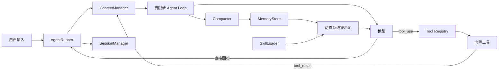

# SimonAgent

> 面向工具编排、上下文治理与持久化记忆的轻量级原生 Agent Runtime。

SimonAgent 基于模型原生工具调用协议自主构建，完整实现模型决策、工具执行、结果回填与终止控制。系统同时提供流式交互、会话隔离、持久化记忆、上下文压缩和工具调用追踪能力。

项目采用小型可审计内核，在控制代码规模的同时保留配置校验、原子持久化、失败回滚、安全访问边界和离线测试等工程能力，可用于研究 Agent 运行机制，也可作为个人智能应用的扩展基础。

## 核心特性

| 核心特性 | 工程价值 |
|---|---|
| 框架无关的有限步执行循环 | 显式实现“模型判断 → 工具执行 → 结果回填 → 再判断”，执行状态清晰可审计 |
| 流式回复与工具调用共存 | 普通文本即时输出，结构化 `tool_use` 仍能进入下一步执行 |
| 稳定引用上下文 | 压缩只替换列表内容，不切断 Session 与 Context 的共享关系 |
| 双层上下文治理 | 本地滑动窗口控制即时体积，LLM 压缩把旧信息沉淀为长期记忆 |
| 记忆提交边界 | 长期记忆、用户画像、情景记忆统一提交；失败时保留完整对话并尽力恢复旧文件 |
| 声明式工具系统 | 工具元数据、JSON Schema、处理函数集中声明，注册即暴露给模型 |
| 并发工具执行 | 单轮多个 `tool_use` 由线程池并行执行，结果按原顺序回填 |
| 按需加载 Skill | 启动时只展示技能摘要，需要时才把完整工作流注入模型上下文 |
| 可观测且默认脱敏 | 工具调用进入内存环形缓冲和 JSONL 日志，常见敏感字段自动隐藏 |
| 面向本地使用的安全边界 | 无任意命令执行；网页访问限制公网地址；项目读取主动排除密钥和记忆数据 |
| 可离线验证 | 81 项单元测试覆盖循环、上下文、记忆、会话、工具协议和主要安全分支 |

## 技术定位与当前边界

SimonAgent 是围绕模型原生工具调用协议构建的本地 Agent Runtime：

- 不依赖上层 Agent 编排框架，核心循环、上下文管理和工具调度均由项目自主实现；
- 支持 Anthropic SDK 及兼容该协议的模型端点；
- 具备工具、Skill、记忆、会话和上下文压缩；
- 当前项目检索属于受限的字面量源码搜索，尚未引入 Embedding、向量召回与重排链路；
- 当前运行模型面向单用户本地场景，会话文件相互隔离，长期记忆与用户画像由实例共享。

## 整体架构



一轮请求的实际路径：

1. `AgentRunner` 接收输入并建立本轮回滚点；
2. `ContextManager` 写入用户消息并在需要时裁剪旧轮次；
3. 模型决定直接回答还是返回一个或多个 `tool_use`；
4. `Tool Registry` 校验参数、执行工具并记录 Trace；同一轮多个 `tool_use` 由线程池并行执行；
5. 工具结果以标准 `tool_result` 回到上下文，模型继续判断；
6. 正常结束后检查是否需要压缩记忆，并原子保存当前 Session。

单轮最多执行 `AGENT_MAX_STEPS` 次模型判断，避免无限工具循环和不可控调用成本。

## 项目结构

```text
SimonAgent/
├── agent.py                       # 命令行入口
├── core/
│   ├── config.py                  # 不可变设置与惰性模型客户端
│   ├── runner.py                  # REPL、命令路由与单轮事务边界
│   ├── loop.py                    # 流式模型调用与有限步工具循环
│   ├── context.py                 # 消息窗口、工具结果截断与原位压缩
│   ├── compactor.py               # LLM 记忆压缩及完整性校验
│   ├── memory.py                  # 记忆快照、提交与降级保护
│   ├── session.py                 # 会话模型、校验与原子保存
│   ├── skill.py                   # Skill 发现、校验和按需加载
│   ├── storage.py                 # 原子文本写入与 JSON 标准化
│   └── exceptions.py              # 核心异常体系
├── tools/
│   ├── base.py                    # 不可变工具定义
│   ├── parallel_executor.py       # 线程池并行执行多个工具调用
│   ├── registry.py                # 声明、参数校验、执行与 Trace
│   ├── trace.py                   # 内存环形缓冲 + JSONL 日志
│   └── builtin/
│       ├── calculator.py          # AST 白名单计算器
│       ├── search.py              # Tavily 网络搜索
│       ├── webpage.py             # 公开网页正文提取
│       └── workspace.py           # 安全的项目检索与文件读取
├── Skill/                         # 可按需加载的工作流说明
├── templates/
│   ├── SOUL.md                    # 默认人格
│   ├── MEMORY.md                  # 长期记忆初始模板
│   ├── USER.md                    # 用户画像初始模板
│   └── agent/compact_prompt.md     # 记忆压缩提示词
├── memory/                        # 运行时共享记忆（本地生成）
├── sessions/                      # 独立会话快照（本地生成）
├── logs/                          # 工具调用日志（本地生成）
├── tests/                         # 离线单元测试
├── .env.example                   # 配置示例
└── requirements.txt
```

`templates/` 与 `memory/` 采用职责分离设计：前者保存可提交、可复用的初始资产；后者承载运行中的用户画像、长期记忆和情景记忆，运行数据不反向覆盖模板。

## 内置工具

| 工具 | 用途 | 关键限制 |
|---|---|---|
| `load_skill` | 加载指定 Skill 的完整工作流 | 只能加载已发现且格式有效的 Skill |
| `calculator` | 精确计算数学表达式 | AST 白名单、节点数、深度、幂指数和结果范围限制 |
| `web_search` | 搜索实时网络资料 | 需要 Tavily Key；查询和响应长度受限 |
| `fetch_webpage` | 读取候选网页正文 | 仅公网 HTTP(S) 80/443；限制重定向、内容类型和 1 MB 响应体 |
| `search_workspace` | 在项目中定位符号与文本 | 只读允许的文本类型，排除配置、记忆、会话和日志 |
| `read_workspace_file` | 按行阅读已定位文件 | 仅项目内相对路径，拒绝路径穿越、软链接和超大文件 |

两组工具可以自然组成研究链路：

```text
web_search → fetch_webpage
search_workspace → read_workspace_file
```

调用顺序并未硬编码；模型根据工具描述和当前问题自主决定是否继续。

## 内置 Skills

Skill 是“如何完成一类任务”的工作流，不是新的执行权限。实际能力仍由现有工具提供。

| Skill | 适用场景 |
|---|---|
| `api-integration-helper` | 核对官方 API 文档，设计认证、请求、重试、限流、异常处理和测试方案 |
| `code-investigator` | 沿真实源码调用链解释实现、定位故障并引用文件与行号 |
| `source-researcher` | 对最新信息或技术方案进行多来源核对，区分事实、推断和资料冲突 |

示例：

```text
请使用 api-integration-helper，设计 GitHub REST API 的 Python 接入方案。
请使用 code-investigator，解释工具结果如何回到模型。
请使用 source-researcher，对比两个 Agent 框架并附上官方来源。
```

新增或修改 Skill 后需要重新启动 Agent，让 `SkillLoader` 重新扫描目录。

## 上下文与记忆

### 两层压缩

第一层是零模型成本的本地窗口治理：

- 限制最大用户轮次、消息数和近似 Token 数；
- 截断过长的工具结果，保留首尾关键信息；
- 只从完整用户轮次边界裁剪，避免留下孤立的 `tool_result`；
- 使用原位替换保持 Session 和 Context 的共享引用稳定。

第二层是 LLM 记忆压缩：

- 旧对话超过阈值后，按完整轮次分成“待沉淀部分”和“近期上下文”；
- 模型必须返回 `episode`、`updated_memory`、`updated_user` 三个完整区块；
- 格式不完整、模型失败或存储失败时，不裁剪任何原始上下文；
- 提交成功后，旧信息进入记忆，近期完整轮次继续留在上下文中。

近似 Token 仅用于本地提前裁剪，不代表模型厂商的精确计费数值。

### 持久化数据

| 类型 | 运行时位置 | 作用 |
|---|---|---|
| 会话上下文 | `sessions/<session-id>.json` | 每个会话独立保存，可切换和恢复 |
| 长期记忆 | `memory/MEMORY.md` | 跨会话保留仍然有效的目标、事实和决策 |
| 用户画像 | `memory/USER.md` | 保存用户明确表达的稳定偏好 |
| 情景记忆 | `memory/Contextual memory/YYYY-MM-DD.md` | 记录当天压缩出的事件摘要 |
| 原始档案 | `memory/history.jsonl` | 追加记录原始消息，不参与自动召回 |

长期记忆、用户画像和当天情景记忆会在每次模型调用前形成只读快照，并与人格、工具原则和 Skill 摘要一起动态组成系统提示词。

## 快速开始

### 1. 准备环境

推荐 Python 3.11。在 `SimonAgent` 目录中安装依赖：

```powershell
python -m pip install -r requirements.txt
Copy-Item .env.example .env
```

如果使用 Conda：

```powershell
conda create -n simon-agent python=3.11
conda activate simon-agent
python -m pip install -r requirements.txt
```

### 2. 配置模型

编辑 `.env`，至少填写：

```dotenv
ANTHROPIC_API_KEY=你的密钥
ANTHROPIC_MODEL=你的模型名
```

使用兼容端点时再填写：

```dotenv
ANTHROPIC_BASE_URL=https://你的兼容端点
```

如需使用 `web_search`，还要配置：

```dotenv
TAVILY_API_KEY=你的Tavily密钥
```

系统环境变量的优先级高于 `.env`，便于在服务器或容器中注入密钥。

### 3. 启动

项目使用包内相对导入，请在 `SimonAgent` 的父目录运行：

```powershell
python -m SimonAgent.agent
```

### 4. REPL 命令

```text
/new          创建新会话
/list         列出已保存会话
/switch <id>  按完整 ID 或唯一前缀切换会话
/trace [n]    查看最近 n 条工具调用
/help         显示帮助
/exit         退出
```

## 配置参考

| 变量 | 默认值 | 作用 |
|---|---:|---|
| `AGENT_MAX_TURNS` | `20` | 上下文最大用户轮次 |
| `AGENT_CONTEXT_MAX_MESSAGES` | `40` | 上下文最大消息数 |
| `AGENT_CONTEXT_MAX_TOKENS` | `12000` | 上下文近似 Token 预算 |
| `AGENT_TOOL_RESULT_MAX_CHARS` | `3000` | 单条工具结果保留长度 |
| `AGENT_TOOL_MAX_WORKERS` | `4` | 并行执行多个工具调用时的线程数 |
| `AGENT_MEMORY_COMPACT_AFTER` | `18` | 触发 LLM 压缩的消息数 |
| `AGENT_MEMORY_COMPACT_AFTER_TOKENS` | `8000` | 触发 LLM 压缩的近似 Token 数 |
| `AGENT_RECENT_MESSAGES` | `10` | 压缩后期望保留的近期消息数 |
| `AGENT_MAX_STEPS` | `8` | 单轮最大模型判断次数 |
| `AGENT_MAX_OUTPUT_TOKENS` | `1000` | 单次模型输出上限 |
| `AGENT_SOUL_FILE` | `SOUL.md` | `templates/` 下的人格文件名 |

所有数值配置会在启动时统一校验，非整数或非正数会直接给出明确的配置错误。

## 如何扩展

### 增加一个 Tool

1. 在 `tools/builtin/` 编写职责单一的处理函数；
2. 在 `tools/registry.py` 中声明名称、描述、JSON Schema 和 handler；
3. 在 `tests/` 中覆盖成功、错误和安全边界。

注册表会统一完成参数检查、异常转译和 Trace，无需为每个工具重复编写包装类。

### 增加一个 Skill

在 `Skill/<skill-name>/SKILL.md` 中写入：

```markdown
---
name: example-skill
description: 说明它解决什么问题，以及什么时候应该加载。
---

# 工作方式

这里写模型需要遵循的具体流程和能力边界。
```

Skill 名称必须使用小写字母、数字和连字符；无效、重复或损坏的定义会被单独跳过，不影响 Agent 启动。

### 自定义人格

复制 `templates/SOUL.md`，例如创建 `templates/SOUL_custom.md`，然后配置：

```dotenv
AGENT_SOUL_FILE=SOUL_custom.md
```

自定义人格文件默认被 `.gitignore` 排除，避免私人设定意外提交。

## 测试

完整测试不需要真实模型或网络：

```powershell
python -m unittest discover -s SimonAgent/tests -t .
```

当前共 81 项，主要覆盖：

- Agent 直接回复、工具调用、工具配对和步数上限；
- 上下文轮次、消息数、近似 Token、压缩边界和回滚；
- 记忆模板初始化、完整提交、失败降级和模型输出校验；
- 会话隔离、前缀切换、损坏文件和路径穿越；
- 工具 Schema、参数类型、未知参数和导入循环；
- 计算器白名单、网页访问限制、项目文件边界；
- 工具并行执行的顺序保持、错误降级和异步封装；
- Trace 环形缓冲、持久化和敏感字段脱敏。

## 安全与能力边界

- 项目不向模型暴露任意 Shell 或 Python 执行能力；
- `.env`、运行时记忆、会话与日志均被版本控制忽略；
- 工作区工具只读允许的项目文本，并拒绝软链接、绝对路径和路径穿越；
- 网页工具具有基础 SSRF 防护，但不是面向不可信公网用户的完整网络沙箱；
- JSON 文件适合单机学习与个人使用，不支持多进程并发写入和多租户隔离；
- 记忆压缩依赖模型总结，重要业务数据仍应由确定性存储负责；
- Skill 仅定义任务工作流，不能绕过工具权限或获得底层工具未提供的第三方账户能力。

## 演进规划

- 抽象模型 Provider，支持不同工具调用协议；
- 增加真正的 RAG 检索工具，并用召回评测验证效果；
- 将 Session 与 Memory 替换为数据库或 Redis 存储；
- 为并发工具调度增加超时预算和取消机制；
- 引入结构化日志、评测集和持续集成。

SimonAgent 以可审计、低耦合和明确运行边界为设计原则，在有限规模内形成了具备工具编排、状态治理、持久化与可观测能力的 Agent 核心实现。
